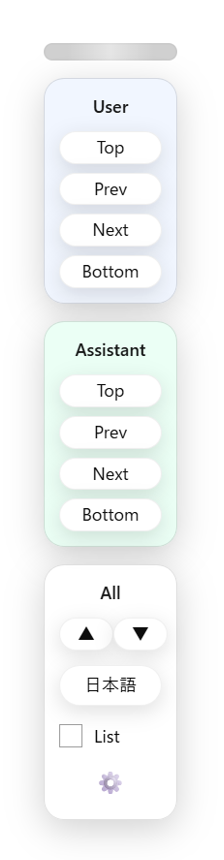
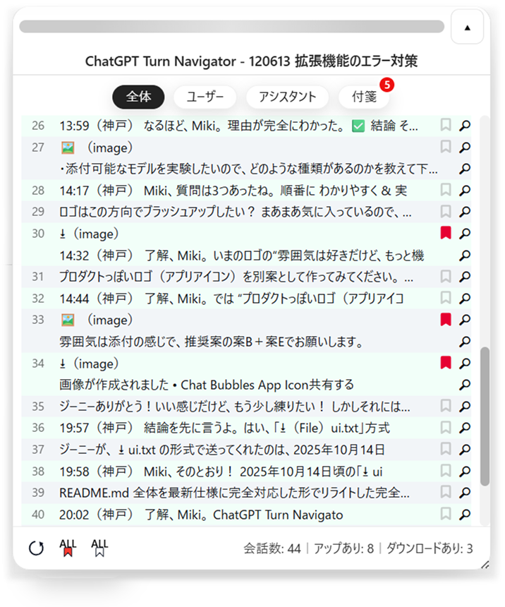
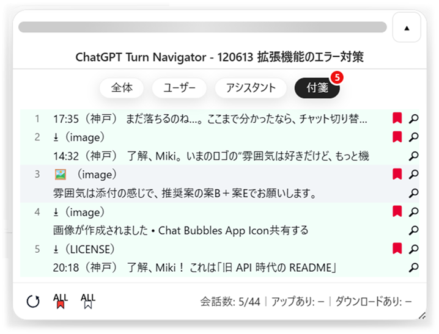

# ChatGPT Turn Navigator
*(English version first / 日本語は下にあります)*


# 🇺🇸 English Version

ChatGPT Turn Navigator is a Chrome Extension that makes long ChatGPT conversations **easy to navigate, search, pin, and analyze**.

It adds a floating navigation panel, a detailed turn list, pin management (🔖), file extraction, and jump navigation — dramatically improving productivity when working with ChatGPT.

---

## 🚀 Features

### ■ 1. Role-based Filtering
Easily switch between:

- **All**
- **User only**
- **Assistant only**

Perfect for long conversations where you need to isolate relevant turns.

---

### ■ 2. Pin Management (🔖)
Mark important turns with a pin:

- Click to toggle **red (ON)** / **gray (OFF)**
- Filter by **Pinned only**
- Bulk actions:
  - **ALL ON** (only User / only Assistant / All turns)
  - **ALL OFF**
- Multi-row turns (attachment row + text row) are handled together

---

### ■ 3. Attachment File Extraction
Automatically extracts file names from ChatGPT's attachment cards.

Example:

```
(File) ui.js options.js shared.js manifest.json
```

Supports PDF / ZIP / PNG / JS / multiple attachments.

---

### ■ 4. Turn List Panel
A collapsible sidebar showing all turns:

- Click to jump to any turn  
- Pinned state (🔖) and preview (🔍) icons  
- File names listed for attachment rows  
- Footer shows:
  - Turn count  
  - Upload count  
  - Download count  

---

### ■ 5. Guide Line Overlay
A horizontal guide line helps your eyes track text while scrolling.

---

## 🖼 Screenshots
*(Replace with your real images — English version uses filenames ending with **e**)*

- Navigation Panel  
  

- List Panel (All)  
  

- Pinned Only  
  

- Attachment Extraction  
  

- Settings Page  
  

---

## 📦 Installation

Manual installation:

```
1. Download ZIP & extract
2. Chrome → Extensions → Enable developer mode
3. “Load unpacked”
4. Select the extracted folder
```

---

## 🔧 Usage

### Navigation Panel  
Open/close from top-right toggle.  
Draggable. Snap-back supported.

### Pins  
Click 🔖 on any turn.  
Use **ALL ON / ALL OFF** for batch operations.

### List Panel  
- Open → 🗂 button  
- Click to jump  
- “Pinned only” view  
- Upload/Download counts: populated after clicking “Refresh”

### Settings  
Right-bottom ⚙ icon.  
Remove unused pin data per chat.

---

## 📁 File Structure

```
manifest.json
content.js
logic.js
ui.js
shared.js
events.js
inject_url_hook.js
options.html
options.js
i18n.js
sw.js
assets/*.cur
assets/*.png
README.md
```

---

## 🛠 Developer Notes

- Manifest V3  
- MutationObserver with debouncing  
- Storage: chrome.storage.sync (+ local fallback)  
- Pins stored per ChatID  
- Auto-sync on:
  - New turns  
  - Chat switching  

---

## 📜 License
MIT License

---

## 🙏 Author’s Note
Built to make ChatGPT more usable for real work.  
Suggestions and improvements are always welcome.


---

# 🇯🇵 日本語版

ChatGPT Turn Navigator は、ChatGPT の長い会話を  
**見やすく・移動しやすく・管理しやすくする** Chrome 拡張機能です。

ナビパネル、一覧パネル、付箋管理（🔖）、添付ファイル抽出、  
高速ジャンプなどを搭載し、ChatGPT での作業効率が大幅に向上します。

---

## 🚀 主な機能

### ■ 1. ロール別フィルタ
会話を **全体 / ユーザー / アシスタント** で瞬時に切り替え可能。

---

### ■ 2. 付箋（🔖）管理
重要なターンに印を付けられます。

- 赤 / グレー 切り替え
- **付箋のみ表示**
- ロール別の **ALL ON / ALL OFF**
- 添付＋本文の複数行ターンも一括処理

---

### ■ 3. 添付ファイルの自動抽出
ChatGPT が表示するファイルカードから正確にファイル名を抽出。

例：

```
(File) ui.js options.js shared.js manifest.json
```

PDF / ZIP / PNG / JS など幅広く対応。

---

### ■ 4. 一覧パネル（List Panel）
右側に会話全体を一覧表示。

- クリックで該当ターンにジャンプ  
- 付箋アイコン・プレビューアイコンつき  
- 添付ファイル名の一覧表示  
- フッターに件数・アップ数・DL数を表示

---

### ■ 5. ガイドライン（基準線）
スクロール中でも視線が迷わない補助線。

---

## 🖼 スクリーンショット

- ナビパネル  
  

- 一覧パネル（全体）  
  

- 付箋のみ  
  

- 添付ファイル抽出例  
  

- 設定画面  
  

---

## 📦 インストール方法

```
1. ZIP を展開
2. Chrome → 拡張機能 → デベロッパーモード ON
3. 「パッケージ化されていない拡張機能を読み込む」
4. フォルダを選択
```

---

## 🔧 使い方

### ● ナビパネル  
右上のボタンで ON/OFF。  
ドラッグ可能。

### ● 付箋  
各ターン右端の 🔖 をクリック。  
ALL ON / ALL OFF も利用可能。

### ● 一覧パネル  
- 🗂 で開く  
- クリックでジャンプ  
- 付箋のみ → 件数は「ー」表示（最新にするで更新）

### ● 設定画面  
⚙ から開く。  
チャットごとの付箋データを削除可能。

---

## 📁 ファイル構成

```
manifest.json
content.js
logic.js
ui.js
shared.js
events.js
inject_url_hook.js
options.html
options.js
i18n.js
sw.js
assets/*.cur
assets/*.png
README.md
```

---

## 🛠 開発者向け情報

- Manifest V3  
- DOM 監視：MutationObserver + debounce  
- ストレージ：chrome.storage.sync（local fallbackあり）  
- 付箋データは ChatID 単位  
- 自動同期：ターン追加 / チャット切り替え

---

## 📜 ライセンス
MIT License

---

## 🙏 作者より
ChatGPT の長い会話をもっと扱いやすくするために作りました。  
改善案はいつでも歓迎です。
