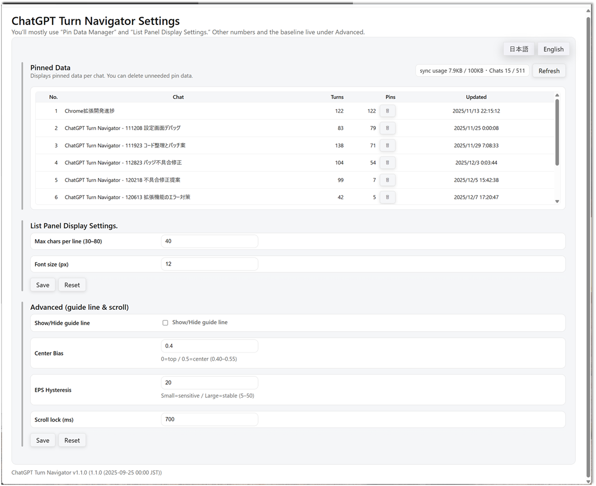
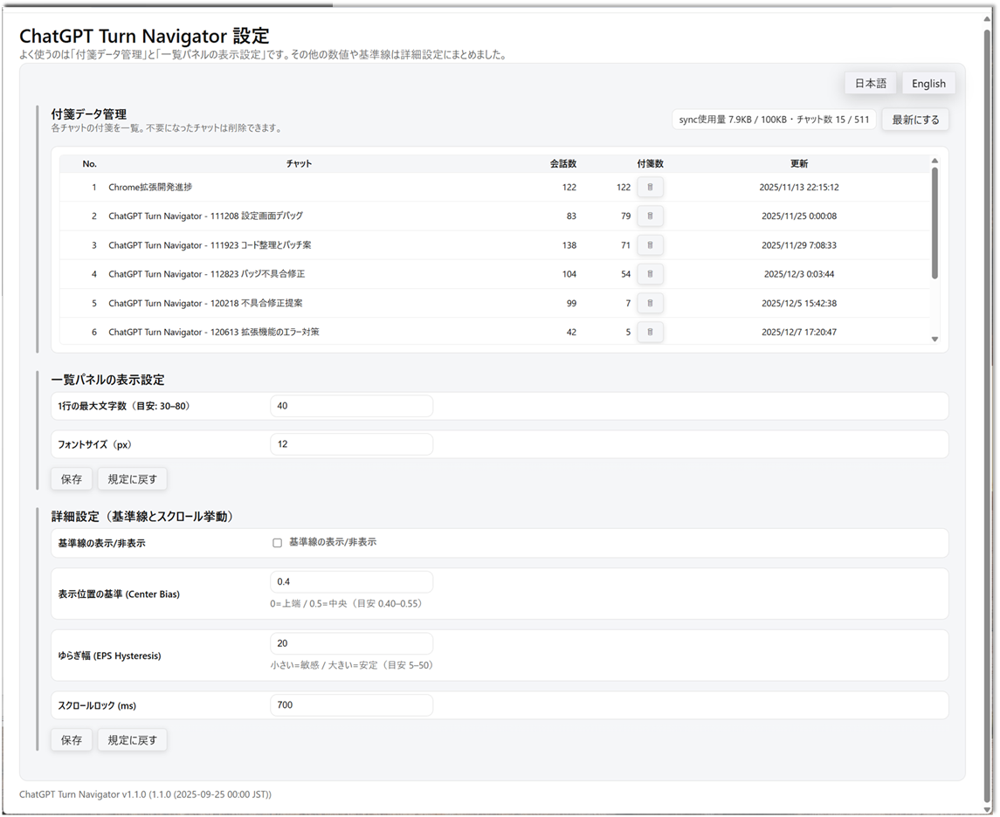

# Turn Navigator for ChatGPT

*(English version first / 日本語は下にあります)*

# 🇺🇸 English Version

**Turn Navigator for ChatGPT** is a Chrome Extension (Manifest V3) that dramatically improves your ability to **navigate, review, and manage long ChatGPT conversations**.

It adds:

* A floating navigation panel
* A full turn list with jump navigation
* Pin management (🔖)
* Turn preview
* **Image attachment detection**
* JA / EN language toggle

Designed for long research threads, programming work, documentation, project logs, and any ChatGPT workflow that grows beyond a few dozen turns.

---

## 🚀 Features

### ■ 1. Role-based Filtering

Switch the navigation target instantly:

* **All turns**
* **User only**
* **Assistant only**

Greatly reduces scrolling fatigue.

---

### ■ 2. Pin Management (🔖)

Mark important turns and filter them later.

* Toggle ON/OFF
* “Pinned only” mode
* Pins are stored per chat
* Uses `chrome.storage.sync` (with size limits)

---

### ■ 3. Attachment Detection (Current Behavior)

Navigator currently detects **ChatGPT-generated images only**.

**Detected:**

* ChatGPT-generated images (PNG / JPG / WebP)

**Not detected:**

* ChatGPT’s **Download button attachments** *(planned for a future update)*
* User uploads
* Filenames written in plain text
* Code blocks

---

### ■ 4. Turn List Panel

A collapsible sidebar showing every turn.

Includes:

* Role icon
* Snippet preview
* Pin toggle
* Attachment icon
* Footer with counts

Clicking jumps to and highlights the selected turn.

---

### ■ 5. Turn Preview

Preview any turn **without jumping**.

Useful for checking:

* Long replies
* Code
* Images
* Previous reasoning

---

### ■ 6. Guide Line Overlay

A horizontal guideline helps maintain visual orientation when scrolling.

---

## 🖼 Screenshots

### **Main UI: Navigator + Turn List**


### **Settings Panel**


---

## 📦 Installation

1. Download and extract ZIP
2. Open Chrome → `chrome://extensions/`
3. Enable **Developer mode**
4. Click **Load unpacked**
5. Select the folder containing `manifest.json`

---

## 🔧 Usage

### Navigation Panel

Drag to reposition.
Jump between roles or sequentially.

### Pins

Click 🔖 to toggle.
Use “Pinned only” to focus on key turns.

### List Panel

Open with the 🗂 button.
Click rows to jump.
Refresh when new attachments appear.

### Settings

Open via ⚙
Clear per-chat pin data.
Adjust list width, preview options, and language.

---

## 📁 File Structure

```
manifest.json
content.js
logic.js
ui.js
shared.js
events.js
inject_url_hook.js
options.html
options.js
i18n.js
sw.js
assets/*.png
assets/*.cur
README.md
```

---

## ⚠ Notes on Long Conversations

ChatGPT may fail to load conversations exceeding **80–120 turns** or consuming **800MB–1GB** memory.

Typical symptoms:

* “Unable to load conversation…”
* 500 errors
* Long blank loading times

These limitations come from **ChatGPT itself**, not the extension.

**Recommended:**

* Split extremely long chats
* Reload the tab if memory usage becomes high

---

## 📜 License

MIT License

---

---

# 🇯🇵 日本語版

**Turn Navigator for ChatGPT** は、長くなった ChatGPT の会話を
**高速に移動・把握・管理できるようにする** Chrome 拡張機能（MV3）です。

ナビパネル、一覧パネル、付箋（🔖）、プレビュー、
**画像添付の検出（Download添付は次版で対応予定）** など、
ChatGPT の実務利用を強力に支援します。

---

## 🚀 主な機能

### ■ 1. ロール別フィルタ

**全体 / ユーザー / アシスタント** を瞬時に切り替え。

---

### ■ 2. 付箋（🔖）管理

重要なターンに印を付けて管理できます。

* ON/OFF
* **付箋のみ表示**
* ChatID ごとに保存
* chrome.storage.sync に保存（容量制限あり）
---

### ■ 3. 添付ファイル検出（現行仕様）

Navigator が検出できるのは **ChatGPT が生成した画像添付のみ** です。

**検出できる：**

* ChatGPT が生成した **PNG / JPG / WebP 画像**

**検出できない：**

* ChatGPT の **Download ボタン形式の添付（次版で対応予定）**
* ユーザーのアップロード
* テキストに書かれたファイル名
* コードブロック

---

### ■ 4. 一覧パネル（List Panel）

会話全体を俯瞰し、任意のターンへ即ジャンプできます。

* クリックでジャンプ
* 付箋・添付アイコン
* フッターで件数表示

---

### ■ 5. プレビュー表示

ジャンプせずにターンの中身を確認できます。

---

### ■ 6. ガイドライン

スクロール中の位置把握を補助します。

---

## 🖼 スクリーンショット

### **主要UI（ナビ + 一覧パネル）**


### **設定パネル**


---

## 📦 インストール方法

1. ZIP を展開
2. Chrome → `chrome://extensions/`
3. デベロッパーモードを ON
4. 「パッケージ化されていない拡張機能を読み込む」
5. フォルダを選択

---

## 🔧 使い方

### ● ナビパネル

表示切り替え＆ドラッグ可能。

### ● 付箋

🔖 をクリックして操作。
「付箋のみ」で一覧を絞り込み。

### ● 一覧パネル

🗂 ボタンで開閉。
行クリックでジャンプ。
画像添付のみ検出（Download添付は次版で対応）。

### ● 設定画面

⚙ から開く。
付箋データ削除・リスト幅調整・言語設定など。

---

## 📁 ファイル構成

```
manifest.json
content.js
logic.js
ui.js
shared.js
events.js
inject_url_hook.js
options.html
options.js
i18n.js
sw.js
assets/*.png
assets/*.cur
README.md
```

---

## ⚠ 長大チャットの注意

会話が非常に長い場合（80〜120ターン以上）
ChatGPT 側で以下が発生する場合があります：

* Unable to load conversation
* 500 エラー
* 画面が白いまま固まる
* メモリ使用量が 800MB〜1GB以上に増加

これは ChatGPT 本体の制限であり、Navigator からは制御できません。

**推奨：**

* 大規模プロジェクトは複数チャットに分ける
* メモリ使用量が増えたらタブを開き直す

---

## 📜 ライセンス

MIT License

---

**Happy navigating ✨**

---
