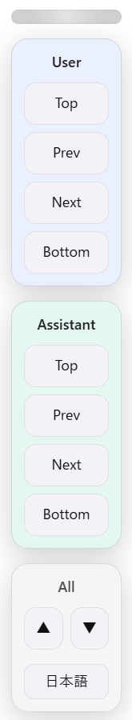
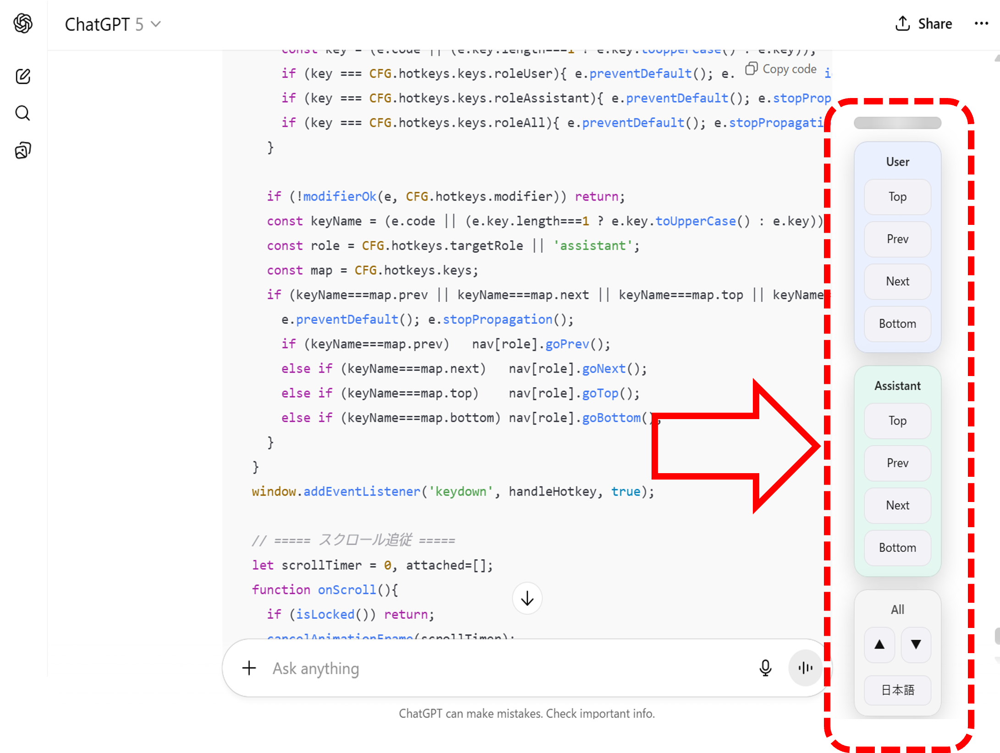
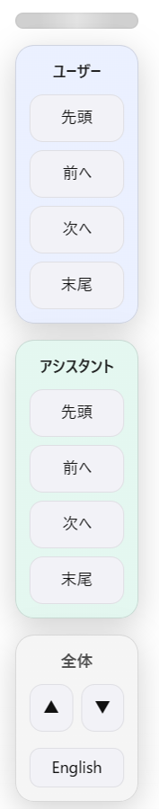

# ChatGPT Turn Navigator

*(English version first / 日本語は下にあります)*

---

## 🚀 English

### Overview  
**ChatGPT Turn Navigator** is a Chrome extension that adds a navigation panel and hotkeys to the ChatGPT interface.  
You can jump between user and assistant messages, scroll smoothly to the top or bottom, switch target roles, and drag the panel to save its position.  

### Features  
- Separate navigation for **User** and **Assistant** messages  
- “All” mode: jump to the very top or bottom of the page  
- Hotkeys (default: **Ctrl + ↑ / ↓ / Home / End**)  
- **Alt + 1 / 2 / 3** to switch target role (User / Assistant / All)  
- Drag the panel to reposition it (position is saved)  
- Light/Dark mode support  

### Screenshots  
English UI:  
  

Full page screenshot:  
  

### Installation (Developer Mode)  
1. Download or clone this repository  
2. Open `chrome://extensions` in Chrome  
3. Enable **Developer mode** (top-right)  
4. Click **Load unpacked** and select the extracted folder  

### Usage & Hotkeys  

| Action | Hotkey | Description |
|--------|--------|-------------|
| Scroll to first message | Ctrl + Home | Jumps to the first message of the selected role |
| Scroll to previous | Ctrl + ↑ | Moves to the previous message |
| Scroll to next | Ctrl + ↓ | Moves to the next message |
| Scroll to last message | Ctrl + End | Jumps to the last message of the selected role |
| Switch target role | Alt + 1 / 2 / 3 | Switch between User / Assistant / All |

### Configuration  
- You can adjust **CENTER_BIAS**, **HEADER_PX**, **SCROLL_LOCK_MS**, and hotkeys via the options page.  
- Panel position is saved automatically when dragged.  

### License & Contribution  
- Licensed under the **MIT License**  
- Contributions and pull requests are welcome!  

---

## 🇯🇵 日本語版

### 概要  
**ChatGPT Turn Navigator** は、ChatGPT の画面にナビゲーションパネルとホットキーを追加する Chrome 拡張です。  
ユーザー／アシスタントの発言間を移動したり、ページ全体の先頭／末尾にジャンプしたりできます。パネル位置の保存やホットキー切り替えにも対応しています。  

### 主な機能  
- ユーザー／アシスタントの発言を個別にナビゲート  
- 「全体」モードでページ最上部／最下部へジャンプ  
- ホットキー（既定: **Ctrl + ↑／↓／Home／End**）  
- **Alt + 1／2／3** で対象ロールを切り替え（ユーザー／アシスタント／全体）  
- パネルをドラッグで移動＆位置保存  
- ダーク／ライトテーマ対応  

### スクリーンショット  
日本語UI:  
  

フルサイズスクリーンショット:  
  

### インストール方法（開発モード）  
1. このリポジトリをダウンロードまたはクローン  
2. Chrome で `chrome://extensions` を開く  
3. 右上で **デベロッパーモード** を ON  
4. 「パッケージ化されていない拡張機能を読み込む」から展開したフォルダを選択  

### 使い方 & ホットキー  

| 操作 | ホットキー | 説明 |
|------|------------|------|
| 先頭の発言へ移動 | Ctrl + Home | 選択ロールの最初の発言へジャンプ |
| 前の発言へ移動 | Ctrl + ↑ | ひとつ前の発言へ移動 |
| 次の発言へ移動 | Ctrl + ↓ | ひとつ次の発言へ移動 |
| 末尾の発言へ移動 | Ctrl + End | 選択ロールの最後の発言へジャンプ |
| 対象ロール切り替え | Alt + 1／2／3 | ユーザー／アシスタント／全体を切り替え |

### 設定  
- **CENTER_BIAS**, **HEADER_PX**, **SCROLL_LOCK_MS** などはオプション画面で調整可能  
- パネル位置はドラッグで移動すると自動保存されます  

### ライセンス・貢献  
- **MITライセンス** で公開  
- 改善提案や Pull Request を歓迎します！
